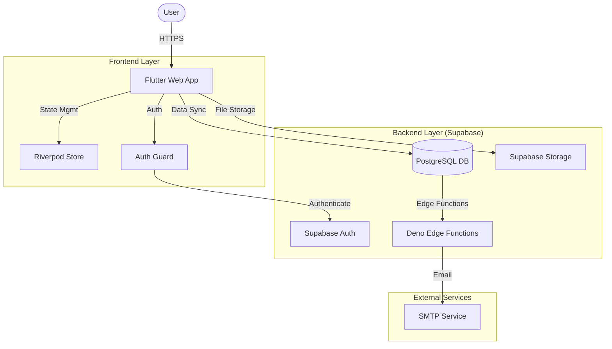
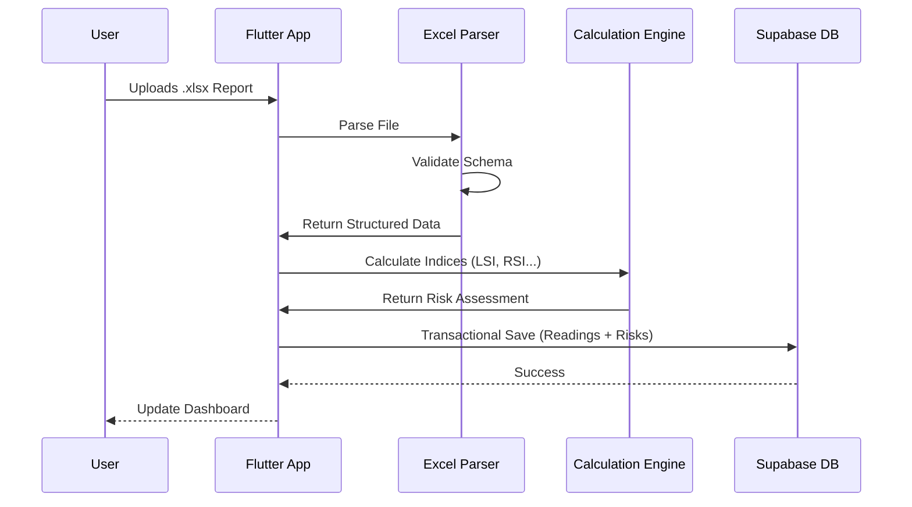

# 🌊 HydroSentinel


**HydroSentinel** is an enterprise-grade industrial water intelligence platform designed to monitor, analyze, and optimize Cooling Tower and Reverse Osmosis (RO) systems. By leveraging advanced chemical modeling and real-time data synchronization, HydroSentinel predicts scaling, corrosion, and fouling risks before they impact operations.

---

## 🚀 Key Features

### 🧪 Advanced Chemistry Analysis
- **Automated Index Calculation**: Instantly computes critical indices including LSI (Langelier Saturation Index), RSI (Ryznar Stability Index), and PSI (Puckorius Scaling Index).
- **Risk Prediction**: Uses predictive algorithms to forecast potential system failures due to scaling or corrosion.
- **Water Quality Monitoring**: Tracks pH, conductivity, hardness, alkalinity, and other vital parameters.

### 🏭 Factory & Asset Management
- **Multi-Tenant Architecture**: Manage multiple factories and sites from a single dashboard.
- **Asset Hierarchy**: Organize data by Factory -> System (Cooling Tower/RO) -> Date.
- **Excel Integration**: Seamlessly import data using standardized `.xlsx` templates.

### 📊 Visualization & Reporting
- **Interactive Dashboards**: Visualize trends over time with dynamic charts.
- **Health Scoring**: Get an immediate "Health Score" for each asset based on latest readings.
- **Actionable Insights**: Receive prioritized maintenance recommendations based on chemical analysis.

### 🔒 Security & Compliance
- **Role-Based Access Control (RBAC)**: Secure access for administrators, engineers, and operators.
- **Audit Logs**: Track all data changes and user actions.
- **Secure Auth**: Powered by Supabase Authentication (Email/Password, OTP).

---

## 🏗️ System Architecture

HydroSentinel is built on a modern, scalable architecture using Flutter for the frontend and Supabase for the backend, containerized with Docker for easy deployment.

### High-Level Data Flow



### Data Processing Pipeline

The application features a robust Excel parsing engine to digitize field reports.



---

## 💻 Technology Stack

- **Frontend**: Flutter (Web targeting)
- **Language**: Dart
- **State Management**: Flutter Riverpod
- **Backend**: Supabase (PostgreSQL, Auth, Storage, Edge Functions)
- **Containerization**: Docker & Nginx
- **Charts**: fl_chart
- **Data Parsing**: excel, csv

---

## 🛠️ Getting Started

### Prerequisites

- [Docker](https://www.docker.com/) installed
- [Flutter SDK](https://flutter.dev/docs/get-started/install) (for local dev)
- [Git](https://git-scm.com/)

### 🐳 Docker Deployment (Recommended)

HydroSentinel is Docker-ready. To deploy the web application:

1.  **Build the Image**:
    ```bash
    docker build -t hydrosentinel .
    ```

2.  **Run the Container**:
    ```bash
    docker run -d -p 8080:80 --name hydrosentinel_app hydrosentinel
    ```

3.  **Access the App**:
    Open `http://localhost:8080` in your browser.

### 🔧 Local Development

1.  **Clone the Repository**:
    ```bash
    git clone https://github.com/A7med580/HydroSentinel.git
    cd HydroSentinel
    ```

2.  **Install Dependencies**:
    ```bash
    flutter pub get
    ```

3.  **Run Locally**:
    ```bash
    flutter run -d chrome
    ```

---

## 📂 Project Structure

```
HydroSentinel/
├── lib/
│   ├── core/           # Shared components (constants, theme, utils)
│   ├── features/       # Feature-based modules (Auth, Dashboard, Factories, etc.)
│   ├── models/         # Data models and entities
│   ├── services/       # External services (API, Excel Parsing)
│   ├── widgets/        # Reusable UI widgets
│   └── main.dart       # Application entry point
├── supabase/           # Supabase configurations and Edge Functions
├── Dockerfile          # Docker build instructions
├── nginx.conf          # Nginx server configuration
└── pubspec.yaml        # Project dependencies
```

---

## 🤝 Contributing

Contributions are welcome! Please try to follow the standard Git flow:

1.  Fork the repository.
2.  Create a feature branch (`git checkout -b feature/amazing-feature`).
3.  Commit your changes (`git commit -m 'feat: Add amazing feature'`).
4.  Push to the branch (`git push origin feature/amazing-feature`).
5.  Open a Pull Request.

---

## 📄 License

This project is licensed under the MIT License - see the [LICENSE](LICENSE) file for details.

---

<p align="center">
  Built with ❤️ by the HydroSentinel Team
</p>

