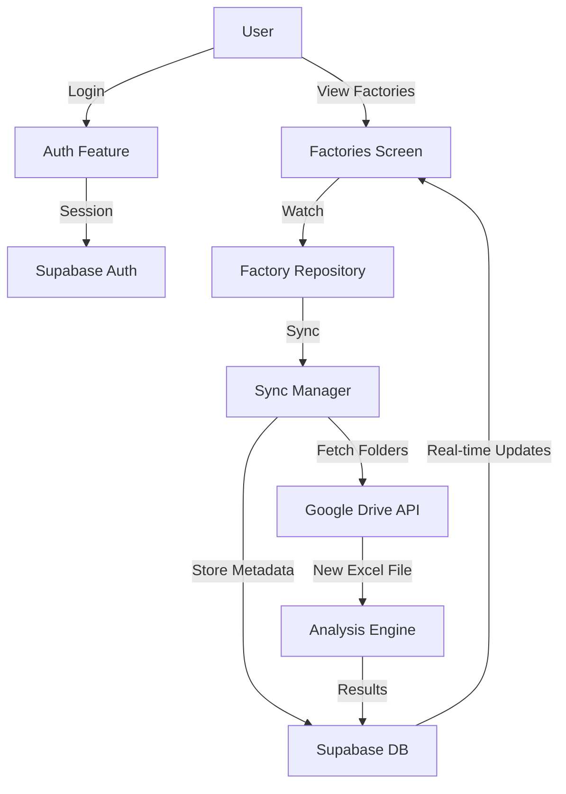
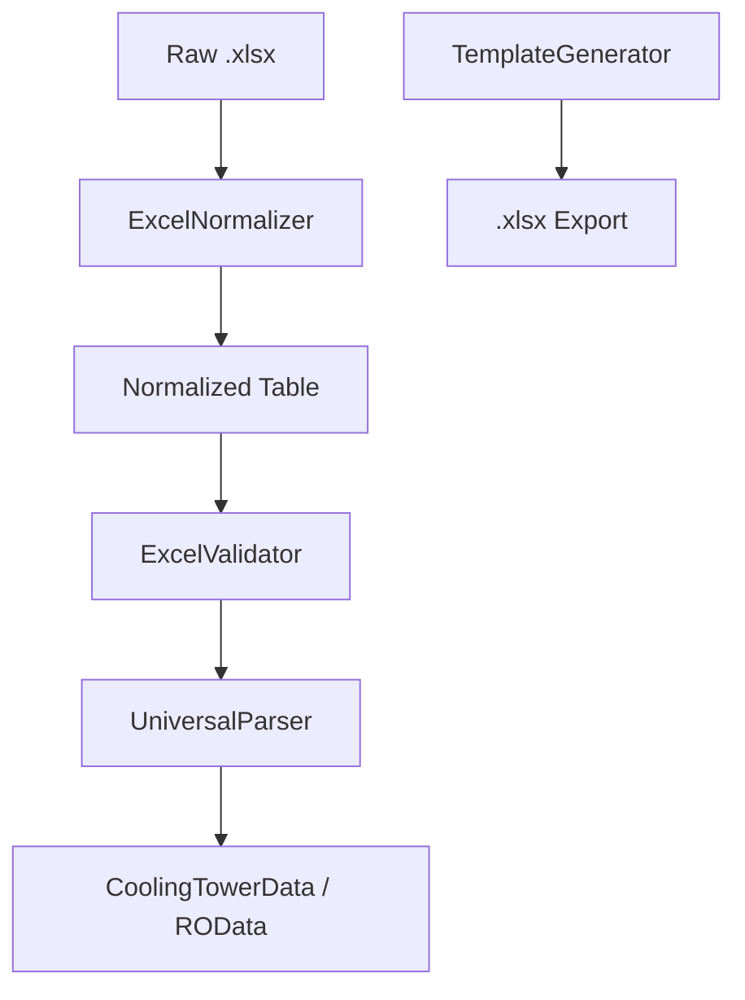
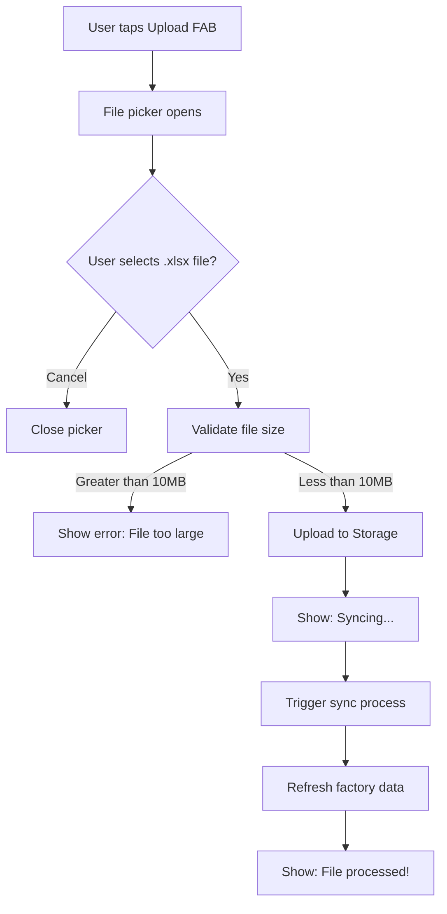

# HydroSentinel


**HydroSentinel** is a Flutter-based industrial water intelligence platform. It analyzes Cooling Tower and RO chemistry to detect Scaling, Corrosion, and Fouling risks. The app provides automated engineering indices, health scoring, and prioritized maintenance recommendations to optimize system performance.

---

---

## 🏗️ Architecture



### Value Extraction Architecture


### File Upload Flow



## 🚀 Features

-   **Advanced Chemistry Analysis**: Automatically calculates indices like LSI, RSI, PSI, and more.
-   **Risk Assessment**: Detects Scaling, Corrosion, and Fouling risks with severity scoring.
-   **Data Import**: Seamlessly import data via Excel (`.xlsx`) templates.
-   **Maintenance Recommendations**: Generates actionable, prioritized maintenance tasks.
-   **Visualization**: View trends and health scores through intuitive dashboards.

## 🛠️ Installation

1.  Clone the repository:
    ```bash
    git clone https://github.com/A7med580/HydroSentinel.git
    ```
2.  Navigate to the project directory:
    ```bash
    cd HydroSentinel
    ```
3.  Install dependencies:
    ```bash
    flutter pub get
    ```
4.  Run the app:
    ```bash
    flutter run
    ```

## 📄 License

This project is licensed under the MIT License - see the [LICENSE](LICENSE) file for details.

---
*Built with ❤️ using Flutter.*
